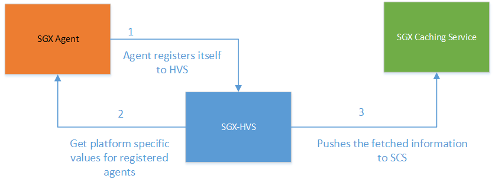
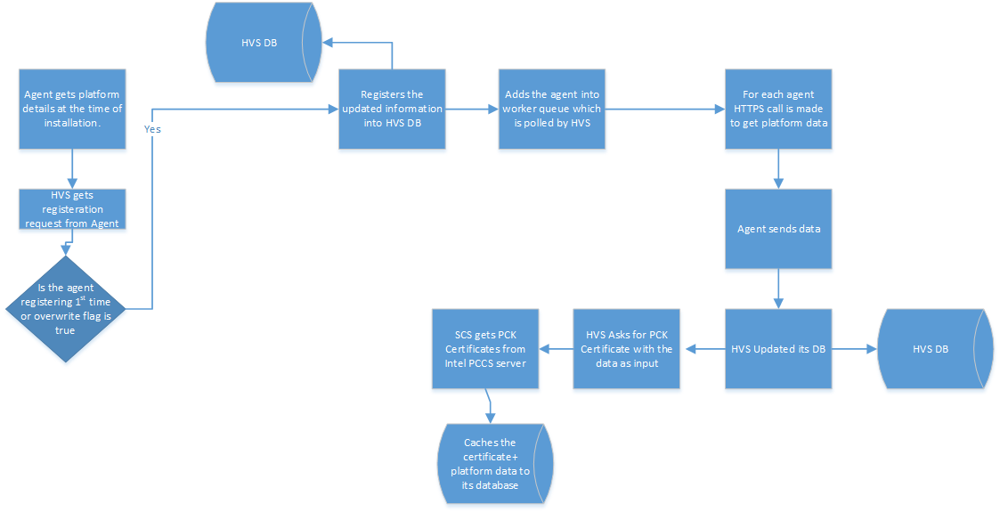
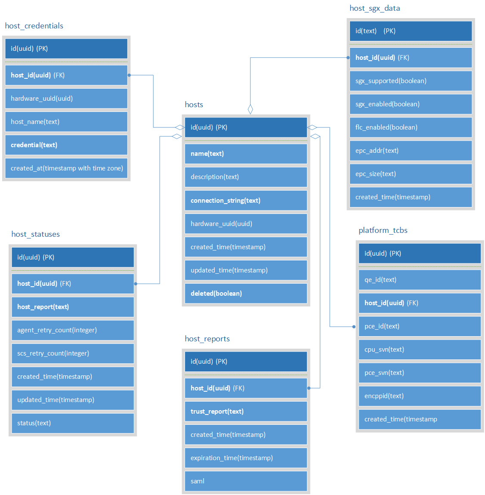

# Architecture Specification for HVS
---
## Table of Contents

1. [Version History](#version-history)
2. [Introduction](#introduction)
3. [Architecture Overview](#architecture-overview)
4. [Detailed Design](#detailed-design)
5. [User Stories](#user-stories)
6. [Deployment](#deployment)
---
## Version History

1. Initial draft - Shefali Kamal - 02/03/2020
---
## Introduction
SGX Verification Service(HVS) registers all agents running on sgx enabled platforms,
 gets platform specific data and pushes this data to caching service. As a 
platform boots it registers to HVS. Once registered HVS query the registered agents to 
get platform specific values once every day. These values are saved in HVS database and 
pushed to SCS.

---
## Architecture Overview
Includes the high level architecture diagram and description of how the various components interact with each other.

### Architecture Details
This LLD describes basic features supported by HVS in registering the agents running on 
platform, getting platform specific values, pushing these values to SCS.
##Components
### HVS Overview
The VS is responsible to retrieve platform details from Agent which has sgx specific values. 
The data is pushed to Caching service.

  
---  
Steps for an overall flow of HVS:

#### Dependent components
N/A
Steps followed:
* Agent requests for registration
* HVS Registers agent and adds its information to its DB. It also add the newly registered agent + agents whose overwritten flag=true to queue
* The queue is polled and accordingly agents in queue are requested for platform details
* The RESTAPI call is made to agents. The url end point is the point provided by agent in input json while registering.
* The information fetched is stored in HVS DB
* Using platform data as input request is made to SGX Caching service(SCS) for PCK Certificate.
* SCS checks in its data base and if no pck certificate for platform details is present gets it from PCCS Server. This PCS server url is in SCS env file.
* SCS gets PCK Certificate, caches it for future interactions.

#### REST API endpoints
* Sample REST API call for HVS Response to SGX-agent if the agent is registered successfully.
     * Description
        * Returns Success/Failure
        * Requires permission(to access this API): <tbd>
        * Content type: application/json
        *   JSON: {
        
                 "Id": "83035b76-4e8a-4c73-a603-912b551409d3",
	              "Status": "Created",
	              "Message": "SGX Host Re-registered Successfully"
                  }

*Sample REST API call from HVS TO SGX-Agent to get platform specific data
    * Description
        *Returns Platform: values
        * Requires permission: <tbd>
        * Content type accepted: application/json
        * Content type application/json
        * Method type: GET
        * Sample call: GET call to https://<sgx agent IP>:<port>/sgx_agent/v1/host
        *Output: {
        
           	"sgx-supported": "true/false",
           	"sgx-enabled": "true/false",
           	"flc-enabled": "true/false",
           	"epc-offset": "<memory offset",
           	"epc-size": "<size in mb>",
           	"enc-ppid": "<platform values>",
           	"pceid": "<platform values>",
           	"cpusvn": "<platform values>",
           	"pcesvn": "<platform values>",
           	"qeid": "<platform values>"
           }
        
Sample JSON for HVS-SCS interaction
This section would include the REST API descriptions with the flow diagram and the sample rest call example.
  * Description
  * Returns n/a
  * Requires permission <tbd>
  * Content type accepted: n/a
  * Content type application/json
  * Method type: POST
  * Sample call: {
  
        "enc_ppid": "",
  	    "cpu_svn": "",
  	    "pce_svn": "",
  	    "pce_id": "",
  	    "qe_id": ""
        }
#### Database design
Following is the database design of HVS.

#### Authentication & Authorization
This section includes how the component would be authenticated and authorized for interacting with other components or end users of the system.
---
## User Stories
This section should cover all the user stories that needs to be tested after the implementation.
1. Agent -HVS
2. HVS-SCS
---
## Deployment
Identify all the deployment options applicable. Each option should capture all the installation changes needed to support the various OS'es specified in the requirements document. It should also address upgrade/downgrade scenarios.